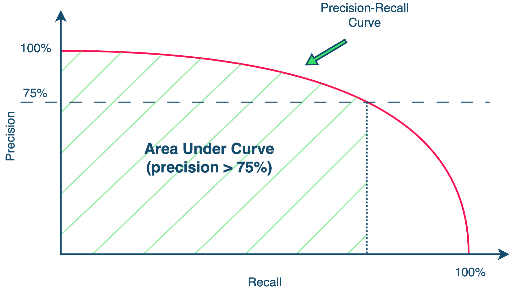

### Задача
Разработайте ML-модель, способную определить идентичность товаров по названиям, атрибутам и изображениям.
Модель должна находить среди пар-кандидатов как можно больше одинаковых товаров с точностью >75%
### Метрика 
Precision-Recall-AUC (Precision = 75%) усреднённый по крупным категориям.

Всего у нас есть 4 уровня категорий. 1 уровень — самый общий (`EPG`, `Apparel` и другие). 2 — более глубокий (`Автотовары`, `Одежда`, `Электроника` и другие). В рамках соревнования рассматриваем только категорию `Электроника` и её подкатегории (категории 3 и 4 уровня). Примеры категорий 3 уровня в `Электронике`: `Компьютер`, `Смарт-часы`, `Смартфоны` и другие. 
Так как рассматриваем только одну категорию 2 уровня, усреднять метрику будем по категориям 3 уровня. 
Крупные категории 3 уровня для обучающей выборки можно получить следующим образом:
```python
train["cat3"] = train["categories"].apply(lambda x: json.loads(x)["3"]) 
train["cat3_grouped"] = train["cat3"].apply(lambda x: x if cat3_counts[x] > 1000 else "rest")
```
`categories` — можно достать из train_data.parquet и test_data.parquet.
`cat3_grouped` — большие категории 3 уровня, по которым будет усредняться метрика (по сути, сливаем все категории с менее чем 1к примерами в обучающей выборке в одну категорию).
